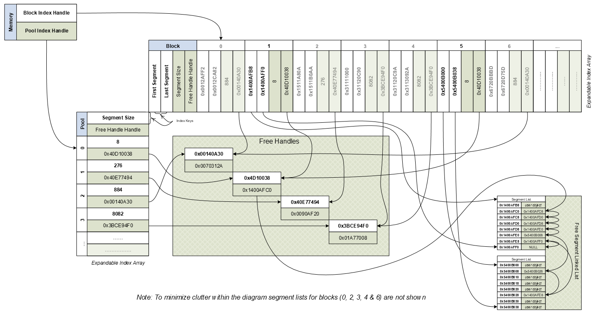

# Smart Pool — Motel Memory Allocator

> **Provenance:** This document explains `smart.pool.png`, a raster export of the original
> Visio 2003 diagram `smart.pool.vsd` (template `BLOCK_U.VST`, authored by John Hart,
> last saved 2010-10-25). The diagram is the design reference for Motel's memory-pool
> allocator implemented in `source/Motel/motel.memory.c`, `motel.memory.h`,
> `motel.memory.i.h`, and `motel.memory.t.h`.

## Overview

The "smart pool" is a **handle-indirected, size-segregated pool allocator**. Two design
choices define it:

1. **Handle indirection.** Nothing refers to memory by raw address. Every reference goes
   through a *handle* that maps to the current object address. Because callers hold handles
   rather than pointers, the allocator can relocate or compact the underlying memory without
   invalidating anything that holds a reference.
2. **Segregated storage by size class.** Allocation is partitioned into pools, each serving a
   single fixed segment size. A request is satisfied from the pool whose size class fits it.

The diagram shows four interconnected structures, wired together by the two root handles in
the `Memory` box at the top-left.

## The root handles — `Memory`

The `Memory` box holds the two entry points into the entire allocator:

- **Block Index Handle** → references the `Block` expandable index array (top-right) — the
  backing store.
- **Pool Index Handle** → references the `Pool` expandable index array (middle-left) — the
  size-class free lists.

## `Pool` — size-class free lists (expandable index array)

The `Pool` is an **expandable index array** indexed `0, 1, 2, 3, …`. Each entry is a size
class with its own free list:

| Pool index | Segment Size | Free Handle Handle |
| ---------- | ------------ | ------------------ |
| 0          | 8            | `0x40D10038`       |
| 1          | 276          | `0x40E77494`       |
| 2          | 884          | `0x00140A30`       |
| 3          | 8082         | `0x3BCE94F0`       |
| …          | …            | …                  |

Allocation is therefore **segregated storage**: pool 0 hands out 8-byte segments, pool 1
hands out 276-byte segments, pool 2 hands out 884-byte segments, pool 3 hands out 8082-byte
segments, and so on. Each entry's **Free Handle Handle** points into the Free Handles region.

## `Block` — backing store (expandable index array)

The `Block` is a second **expandable index array**, indexed by block number (`0`–`6`, then
`…`). These are the contiguous regions that get carved into segments. Each block column carries:

- **First Segment** — address of the first segment in the block
- **Last Segment** — address of the last segment in the block
- **Segment Size** — the segment size for that block
- **Free Handle Handle** — entry into that block's free list
- **Index Keys** — the run of hexadecimal values beneath each block (for example
  `0x0012AFF2`, `884`, `0x00140A30`), used to index into the array

## `Free Handles` — the indirection records

The `Free Handles` region holds handle records, each mapping a *handle* to the current
*object address*. Examples drawn in the diagram:

- `0x00140A30` → `0x0070312A`
- `0x4D10038` → `0x1400AFC0`
- `0x40E77494` → `0x0090AF20`
- `0x3BCE94F0` → `0x01A77008`

This is the layer that makes relocation safe: handles are stable while the addresses they
resolve to can move.

## `Free Segment Linked List` — unused-segment threading

Free segments are threaded into linked lists by next-pointer, giving constant-time allocate
and free. Two segment lists are drawn:

- **List A** (block 1): `0x1400AFB8` → `0x1400AFC0` → `0x1400AFC8` → `0x1400AFD0` →
  `0x1400AFD8` → `0x1400AFE0` → `0x1400AFE8` → `0x1400AFF0` → `NULL`
- **List B**: `0x5400B000` → `0x5400B008` → `0x5400B028` → …

Entries already handed out are marked `user object`; the remaining entries form the free
chain.

> **Diagram note (verbatim):** *"To minimize clutter within the diagram segment lists for
> blocks (0, 2, 3, 4 & 6) are not shown."* Only block 1's segment list is drawn in full.

## Why this matters for Innkeeper v1

The handle-indirection model is load-bearing for the planned save/load work:

- It is almost certainly **why UUID-keyed `LocationStates` can survive a location DLL unload
  and reload** (requirements DR-1): state is referenced by stable keys/handles, not by raw
  pointers that a DLL unload would dangle.
- For the `motel.io` serializer and the state-tree round-trip (work units WU-8 and WU-9),
  knowing the in-memory tree sits behind handle indirection with size-class pools clarifies
  what the serializer must walk and reconstruct.

This memory-layer "smart" pattern is distinct from the I/O-layer pattern documented in
`Smart Interface Pattern.xlsx.md` (a node-operation capability matrix); the two describe
different subsystems.
