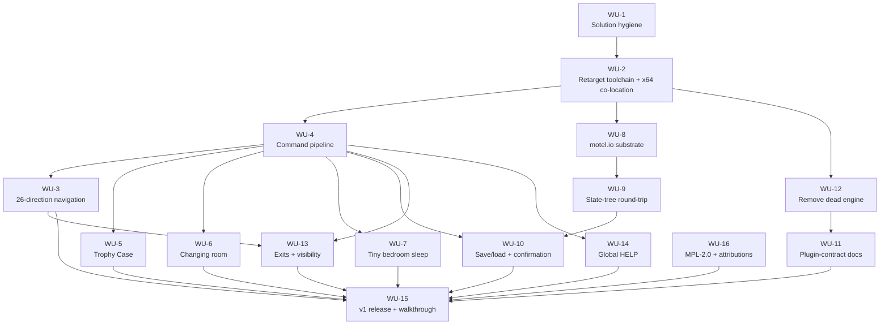

# Innkeeper / Neoheurist — v1 Foundation Implementation Plan

> Requirements: [Innkeeper / Neoheurist — v1 Foundation Requirements](../requirements/2026-06-06-innkeeper-vision-and-v1-foundation.md) — status: ready
> Goal: [Innkeeper / Neoheurist — Full Vision + v1 Foundation Release](../goals/2026-06-06-innkeeper-vision-and-v1-foundation.md) — status: ready

## Summary

| Phase | Count |
| ----- | ----- |
| MVP   | 16    |
| v1    | 0     |
| later | 0     |

Requirement coverage:

```
Covered: 15/15
Uncovered: none
```

All 15 active requirements (11 Must + 4 Should) map to 16 work units. Won't items (FR-9, FR-10, FR-11, NFR-1, NFR-2, NFR-3, NFR-4) are excluded by design.

## Architecture & technology decisions

### AD-1: Build system — retarget MSBuild or migrate to CMake?
**Options considered:**
- Retarget the existing `.vcxproj`/`.sln` (MSBuild) — least work; lowest scope-creep; preserves working project files; Windows-locked but does not preclude a port.
- Migrate to CMake now — sets up cross-platform build infrastructure; but direct hit on the top scope-creep risk, real upfront cost re-expressing 6 projects, and premature with no second platform to validate against.
**Chosen:** Retarget the existing MSBuild `.vcxproj`/`.sln`.
**Rationale:** Lowest-risk path through the gating units; honors "foundation first, not vision"; the `motel.compilation.t.h` seam means deferring CMake costs nothing architecturally — the future port is a next-phase work item.
**Affects:** WU-1, WU-2.

### AD-2: JSON serialization — hand-roll or vendor a C JSON library?
**Options considered:**
- Hand-roll a minimal JSON writer/reader in `motel.io` — zero dependency; clean MPL-2.0 story; payload schema is small and self-controlled; fulfills DR-2's "implement the motel.io serializer."
- Vendor a small permissive library (cJSON/parson/jansson) — battle-tested parsing; but adds a dependency and attribution bookkeeping, and undercuts the DR-2 intent of exercising the serializer.
**Chosen:** Hand-roll the JSON serializer in `motel.io`.
**Rationale:** The payload is small and self-defined; DR-2 frames the work as building the serializer; avoiding a dependency keeps the lean-v1 guardrail and the MPL-2.0 attribution story clean. Single-file MIT parser remains an easy fallback if the read path proves nasty.
**Affects:** WU-8, WU-9.

### AD-3: `.motel` wrapper envelope shape
**Options considered:**
- Streaming-member envelope (`,*`) — metadata as ordinary declarations, JSON as the final streaming member running to end-of-document; spec-native, no escaping, payload stays readable.
- Delimiter-count value (`,N`) — impractical for JSON, whose embedded-colon count is dynamic; the spec offers `,*` precisely to avoid this.
- Extension-only / degenerate wrapper — the rejected "advances nothing" path; no metadata, no versioning, does not exercise `motel.io`.
**Chosen:** Streaming-member (`,*`) envelope around the JSON payload.
**Rationale:** Uses the documented MOTEL streaming-member mechanism (see `documentation/reference/MOTEL.document.md`) for an arbitrarily long trailing opaque payload; needs no escaping; keeps the payload debuggable; gives `motel.io` a minimal but real exercise of the format without the full native serializer DR-2 declined.
**Affects:** WU-8, WU-9, WU-10.

### AD-4: Save-file location & naming
**Options considered:**
- `saves/` beside the EXE — self-contained with the bundle, but "find my executable path" is a per-platform call.
- Per-user app-data dir (`%APPDATA%`/XDG/`Application Support`) — most convention-correct across OSes, but the most per-platform resolution code; premature for single-machine v1.
- Relative `saves/` (CWD-resolved) — most code-agnostic (plain ISO C stdio; only `mkdir` is platform-specific), at the cost of CWD-dependence.
**Chosen:** Relative `saves/` directory (CWD-resolved); `<name>.motel` for named slots; reserved `_continue.motel` for the implicit slot; ISO C `<stdio.h>` for I/O; the single `mkdir` call placed behind the `motel.compilation.t.h` seam.
**Rationale:** Most platform-agnostic concrete approach — file I/O is portable ISO C in every option, and isolating the one platform difference (`mkdir`) at the seam already reserved for the Win32 abstraction satisfies NFR-4's "must not preclude." CWD-dependence is mitigated by documenting "launch from the game directory" in the OR-1 run docs.
**Affects:** WU-10. (Touches the NFR-4 portability seam.)

### AD-5: Dead older engine — remove outright or quarantine?
**Options considered:**
- Remove outright (delete the files) — delivers the goal's "foundation reads honestly"; one unambiguous engine generation for the source-reading author audience; recoverable from git history.
- Quarantine (exclude from build) — reversible, keeps reference code visible; but leaves the two-generations ambiguity FR-7 exists to remove, and the dead code rots.
**Chosen:** Remove the dead older engine outright.
**Rationale:** Git history preserves the older engine (recoverable any time), so deletion loses nothing real while delivering the goal's stated honest foundation. Quarantine keeps alive precisely the ambiguity FR-7 is meant to eliminate.
**Affects:** WU-11, WU-12.

## Test strategy

**Approach:** Manual acceptance. A single **documented manual playthrough** is the acceptance method for v1 — it validates FR-2, FR-3, FR-4, FR-5, FR-8 and UX-1, UX-2, UX-3 by hand. There is **no automated test harness in v1** (a deliberate choice to control scope-creep). The save/reload round-trip (WU-10) and the walkthrough are the load-bearing manual checks.

**Infrastructure:** None beyond the build itself and the five sample room DLLs. The walkthrough is authored and executed as a WU-15 deliverable (the release acceptance gate).

**Coverage targets:** Every committed change keeps the FR-1 build at 0 errors (continuous check). Per-unit definitions of done inherit from each requirement's acceptance criteria; per-unit `Test:` lines below appear only where a unit overrides this top-level strategy (none currently do — all inherit manual acceptance).

## Work breakdown

### Phase: MVP

#### WU-1: Solution hygiene
**Statement:** A developer can open the solution with no missing-project or placeholder errors — the dead references are gone.
**Implements requirements:** FR-1
**Depends on:** —
**Definition of done:**
- The `FD1C5E16-…` reference, the two no-source template projects, and the missing `Item` project reference are removed.
- The solution loads with no missing-project errors.
**Status (2026-06-08): DONE, with correction.** `FD1C5E16-…` (dangling — no files on disk) removed from the `.sln`. The "two no-source dead templates" premise was **falsified by the build**: `xxx.yyy.zzz` is the location-contract header (`#include`d by `main.c`/`sleep.h`/all 5 rooms — kept; see project memory `xxx-yyy-zzz-is-the-location-contract`); `xxxxxxxx-…` kept per user decision (Option A). Both templates remain on disk but are dropped as buildable `.sln` projects (they emit nothing). The `.sln` has no `Item` project reference (the claim was stale); `Item/` headers left in place.

#### WU-2: Retarget toolchain + x64 output co-location
**Statement:** A fresh clone builds the engine EXE and all five room DLLs to completion via one documented invocation on the installed toolchain.
**Implements requirements:** FR-1 (x64 `OutDir`/`IntDir` co-location traces to OR-1)
**Depends on:** WU-1
**Definition of done:**
- Stale `v141` / Windows SDK `10.0.17763.0` pins are retargeted to the installed toolset/SDK and committed (not re-applied by hand).
- A clean clone produces the engine EXE + 5 room DLLs with 0 errors via the documented build path.
- The x64 `OutDir`/`IntDir` co-locate the EXE and room DLLs (traces OR-1).
**Status (2026-06-08): DONE.** Retargeted to `v143` / Windows SDK `10.0.26100.0`. **Win32 dropped — solution is x64-only** (scope refinement: the DLL-per-location model is single-bitness). Co-location solved centrally via `source/Directory.Build.props` (imported by all projects) sending output to repo-root `..\bin\$(Platform)\$(Configuration)\` and intermediates to `..\obj\$(MSBuildProjectName)\$(Platform)\$(Configuration)\`; per-project `OutDir`/`IntDir` overrides removed. Full `Release|x64` rebuild is green — `Neoheurist.exe` + 5 room DLLs + 5 service/library DLLs all co-located in `innkeeper\bin\x64\Release\`. (`bin/`, `obj/`, legacy `Release/` gitignored.)

#### WU-4: Working command pipeline
**Statement:** Typed multi-word player commands parse and dispatch to the correct handler.
**Implements requirements:** FR-3
**Depends on:** WU-2
**Definition of done:**
- The `GetCommand` refactor (self-annotated "severely broken - mid-refactoring" at `source/Command/command.c:64`) is completed.
- The `ParseTokenizedCommand` dangling-pointer return (`source/Command/command.c:341-450`, currently discarded by `source/Main/main.c:662`) is resolved.
- Multi-word commands (e.g. `OPEN TROPHY CASE`, compound directions) dispatch correctly in the walkthrough.
- No tokenizer change is made — the suspected trailing-space bug was refuted (`TokenizeCommand`, `command.c:326-333`).
**Status (2026-06-08): PARTIAL.** **Dangling pointer RESOLVED** — `ParseTokenizedCommand` now takes `Tokens *` (its returned leftover-token pointer references the caller's buffer, not a dead by-value stack copy). The plan/requirements claim of a *sole* live caller (`main.c:662`) was **wrong**: there are **7 callers** (main.c + `Sleep/sleep.c` + rooms `555.555.553` ×3 / `555.555.554` / `555.555.555`), all updated to pass `&`. Solution rebuilds green on x64. **`GetCommand` refactor COMPLETE** — the by-`pCommandProcessor` rewrite was already in place; **John manually validated the behavior** (interactive run), so the stale "severely broken - mid-refactoring" banner was removed (`command.c`). No tokenizer change (refuted). **WU-4 DONE.**

#### WU-3: 26-direction compass navigation
**Statement:** A player moves among all five sample rooms by issuing direction commands across the full 26-direction compass.
**Implements requirements:** FR-2
**Depends on:** WU-4
**Definition of done:**
- The 26 direction names are present in the command vocabulary (`HEADING_WORDS`).
- Every populated adjacency among the five rooms is reachable by its compound direction word.
- A zero / out-of-bounds / unpopulated direction is refused with "Cannot traverse in that direction."
**Status (2026-06-08): DONE.** The navigation was already fully implemented (once the build was fixed): `HEADING_WORDS` carries all 26 compound directions (`vocabulary.t.h:67`); the movement dispatch (`main.c:1073-1188`) maps every heading word to its `Connections[x][y][z]` cell and calls `LocationLoader`; bare directions get a `"Bolt"` verb injected; `ConnectAdjacentLocations` probes the 26 neighbors by `%d.%d.%d.dll`; `LocationLoader` refuses `000`/out-of-bounds. Added the trailing period to the refusal message to match the AC verbatim ("Cannot traverse in that direction."). **John manually validated** walking the five rooms by direction word. No other code change needed.

#### WU-5: Trophy Case stateful behavior
**Statement:** The Barracks Trophy Case opens, closes, locks, and unlocks consistently.
**Implements requirements:** FR-4
**Depends on:** WU-4
**Definition of done:**
- Open / close / lock / unlock behave consistently in the walkthrough.
**Status (2026-06-08): DONE.** The open/close/lock/unlock state machine (`caseClosure`) is complete and consistent (`555.555.555.c:222-333`); state changes persist via the State service (`done;` → `complete:` → `StateUpdater`). The damage-verb `switch` fall-through is **intentional** (a more-damaged condition cumulatively prints all lesser-damage descriptions) — confirmed by John and documented in-code. John validated the walkthrough.

#### WU-6: Changing room gender/name mutation
**Statement:** The Changing room mutates the player's gender/name and the change persists.
**Implements requirements:** FR-4
**Depends on:** WU-4
**Definition of done:**
- Gender/name mutation persists on the `Context`.
**Status (2026-06-08): DONE.** `AssignGender` mutates `pContext->Gender`; "Set my name to ⟨x⟩" copies into `pContext->Name` — both persist on the `Context` (carried between rooms). The WU-4 dangling-pointer fix is what makes the name-change (which uses the `ParseTokenizedCommand` remainder pointing into `pTokens`) safe. John validated the walkthrough.

#### WU-7: Tiny bedroom sleep delegation
**Statement:** The Tiny bedroom's sleep action delegates to the Sleep module and returns.
**Implements requirements:** FR-4
**Depends on:** WU-4
**Definition of done:**
- Sleep delegates to the Sleep module and returns cleanly in the walkthrough.
**Status (2026-06-08): DONE.** `LocationCommandProcessor` delegates to `SleepProcessor(pContext, pTokens)` first and returns `TRUE` when it handles the command (`555.555.554.c:67-70`); local Alertness/Sleep logic backs it up. John validated the walkthrough.

#### WU-8: `motel.io` serialization substrate
**Statement:** `motel.io` can write and read the minimal `.motel` subset needed to carry an opaque payload.
**Implements requirements:** DR-2
**Depends on:** WU-2
**Definition of done:**
- `motel.io` writes and reads declarations, the member delimiter, and a `,*` streaming member.
- A header-plus-opaque-payload document round-trips (envelope written, then parsed back to the same metadata + payload bytes).
**Status (2026-06-08): DONE.** Implemented the in-memory serializer (Option A): `source/Motel/motel.io.c` + fleshed-out `motel.io.t.h`/`.i.h` + new `motel.io.h`, wired into `Motel.vcxproj` and exported from `motel.def`. `WriteMotelDocument` emits `:<Name>:<Value>` header declarations then a final `:<Name>,*:<payload>` streaming member (runs to end-of-document); `ReadMotelDocument` parses headers into a `motelField[]` and returns the streaming name + payload as zero-copy pointers into the document. Verified with a standalone MSVC round-trip harness: 3 header fields + payload recovered byte-for-byte, **including embedded colons, braces, and newlines** in the opaque payload (no escaping). Solution builds green (11 binaries). File I/O + `saves/` dir are deferred to WU-10 (per AD-4).

#### WU-9: State-tree serialize / deserialize
**Statement:** The UUID-keyed state trees round-trip to JSON with full fidelity.
**Implements requirements:** DR-1
**Depends on:** WU-8
**Definition of done:**
- Both `LocationStates` and `ItemStates` (empty in v1) trees serialize to JSON and deserialize.
- A round-tripped state is behaviorally identical to the pre-save state.
- State remains UUID-keyed (survives DLL unload/reload).

**Decision (2026-06-08): Option 1 — location-provided (de)serialization contract hook.** The engine cannot serialize state generically: `LocationStates` is `UUID(37) → void*(8)` (`main.c:609`), each room owns an opaque `State` struct of engine-unknown size/layout (e.g. `555.555.555` carries `caseClosure`, `caseCondition`, `ItemStates`), and the State heap blocks are mutated only through each room's own functions. So each location will provide `StateSerializer` / `StateDeserializer` exports (expanding the location contract; ripples to WU-11 and every populated room + the `xxxxxxxx-…` template). Chosen over opaque-hex options (record `sizeof` / MSVC `_msize`) because it yields readable, portable JSON consistent with AD-2/AD-3 and avoids raw-byte/endianness/pointer-in-struct fragility against the future port (NFR-4); the contract is not yet frozen (WU-11 pending), so widening it now is cheapest.

**Sub-fork (capture timing): [a] serialize-on-exit — CHOSEN (2026-06-08).** Location DLLs are loaded one-at-a-time; `LocationLoader` calls `FreeLibrary` on the outgoing DLL when moving (`main.c:546`), and there is no UUID→coordinate map, so at save time a bare UUID cannot be mapped back to the DLL that owns its serializer. [a] sidesteps this: the engine calls a room's `StateSerializer` while that room's DLL is still loaded (on exit, and the current room at save), caching per-UUID JSON. (Rejected: [b] reload-each-DLL-at-save needs a UUID→coordinate registry and reintroduces multi-DLL juggling; [c] serialize-on-update does [a]'s work plus redundant per-mutation serializes.)

**Forward-compatibility constraint (gating condition on [a], 2026-06-08).** v1 builds single-player save/load but must NOT foreclose (1) multiple players with unique saved states, and (2) players sharing PARTIAL room states (one player altering another's game). Two invariants are therefore load-bearing: **per-UUID granularity in the save format** (payload = collection of `UUID → room-JSON` entries, never one opaque blob) and a **destination-agnostic serializer contract** (room serializes to a buffer; engine owns whether it lands in a private file or a future shared store). Deferred (not foreclosed): multi-player concurrency, the shared backend, merge/conflict semantics, and shared-vs-private field partitioning. See project memory `multiplayer-shared-state-forward-compat`.

**Tree representation: JSON-only — CHOSEN (2026-06-08).** The `LocationStates` tree's durable value becomes the room's JSON (engine-owned), not the opaque DLL-owned `void*` struct. On room entry the engine deserializes JSON → a fresh live struct; the room mutates it during the visit; on exit the engine serializes it back to JSON and frees the live struct. Chosen over JSON-plus-live-pointer for: single source of truth (the forward-compat invariant), continuous serialize+deserialize coverage on every transition (the safety net under v1's manual-only acceptance), and save = a tree dump. (De)serialization is mediated by the **State service via room-provided callbacks** — the SAME pattern as the existing `_StateConstructor` callback — so the engine↔room GetProcAddress ABI (the "5-function contract") is **untouched**; what grows is the room↔State-service API and each room's authoring responsibility (ripples to WU-11).

**Status (2026-06-08): DONE — builds green and manual round-trip verified by John.** Changes: `Context` gained `RoomStateHandle LocationState` (the active visit's live struct; `main.t.h`) + `NULL` init (`main.c`); the State service (`state.c`/`state.i.h`) now restores-from-JSON-or-builds-default in `StateConstructor` (new deserializer callback param), serves the live struct from `Context.LocationState` in `StateRetriever`/`StateUpdater`, and adds `StatePersist` (serialize → engine-owned JSON in the `LocationStates` tree, release the slot) exported via `state.def`; the 3 stateful rooms (`555.555.555`, `555.554.554`, `555.553.553`) each gained static `_StateSerializer`/`_StateDeserializer` (hand-rolled JSON via `snprintf` + an `atoll`-based scan — `/sdl`-clean, avoiding the C4996-banned `sprintf`/`sscanf`), pass the deserializer into `StateConstructor`, and free their own struct (incl. nested `itemList` questa for the two item rooms) in `LocationDestructor` after persisting. The `ItemStates` DoD bullet is satisfied vacuously (empty in v1). **Automated verification:** x64 Release build green, 11 binaries. **Manual verification (PASSED, John, 2026-06-08):** damaged the Trophy Case (`555.555.555`), left, returned → damage persisted, confirming the on-exit-serialize / on-entry-deserialize round-trip.

#### WU-10: Save/load commands, lifecycle, and confirmation
**Statement:** Game state survives process exit and reload via an implicit continue slot and explicit named slots, with clear feedback.
**Implements requirements:** FR-5, UX-1
**Depends on:** WU-9, WU-4
**Definition of done:**
- Save-on-quit / load-on-launch restores prior state via `saves/_continue.motel`.
- `SAVE <name>` then mutate then `LOAD <name>` restores the named snapshot from `saves/<name>.motel`.
- Payload is JSON inside a streaming-member `.motel` envelope (AD-3); files live in a relative `saves/` directory created via the seam-abstracted `mkdir` (AD-4).
- `<name>` is sanitized (path separators / reserved characters rejected).
- Confirmations: "saved as ⟨name⟩" / "loaded ⟨name⟩" / "no save found ⟨name⟩"; save-on-quit / load-on-launch surface a corresponding message.

#### WU-12: Remove dead older engine
**Statement:** Only the live `main.c` + `Location*`-contract generation remains in the tree.
**Implements requirements:** FR-7
**Depends on:** WU-2
**Definition of done:**
- `source/Command/engine.c`, `engine.t.h`, and `rule.*` are deleted.
- The build stays clean and the game still plays with the older generation gone.
**Status (2026-06-08): DONE.** Removed `engine.c`, `engine.t.h`, `rule.def`, `rule.h`, `rule.t.h` (the superseded "rule engine" generation). Confirmed dead first: compiled by no project (Command.vcxproj builds only `command.c`) and `#include`d by nothing live (only each other). Also fixed a residue — `main.c`'s embedded `gCopyright` what-string still read `@(#)engine.c` (from when `main.c` was split out of `engine.c`); corrected to `@(#)main.c`. Full `Release|x64` rebuild green (11 binaries); git history preserves the removed files (AD-5).

#### WU-11: Plugin-contract reference + authoring checklist
**Statement:** An author can build a new room from the documentation alone, without reading engine source.
**Implements requirements:** FR-6
**Depends on:** WU-12
**Definition of done:**
- Written reference covers all five functions: `LocationConstructor`, `LocationDestructor`, `LocationValidator`, `LocationDescriber`, `LocationCommandProcessor`.
- Documents the `.def` export list, the `.vcxproj` GUID, and the hand-typed `OBJECT_ID` UUID requirement.
- Includes a step-by-step room-authoring checklist.
- No proof-room build is required.

#### WU-13: Exits listing + per-direction visibility
**Statement:** A player can see which directions lead somewhere, and locations can hide or make exits one-way-in.
**Implements requirements:** FR-8, UX-3
**Depends on:** WU-3, WU-4
**Definition of done:**
- The `Context` carries a per-direction visibility/suppression flag (additive field, not a new contract function).
- The engine's default exits listing is generated from populated `Connections` and honors the flag.
- The sample world demonstrates a hidden exit (neighbor DLL exists but omitted) and a one-way-in entry (not offered as a return).

#### WU-14: Global HELP command
**Statement:** Typing `HELP` lists the available verbs and the save/load commands.
**Implements requirements:** UX-2
**Depends on:** WU-4
**Definition of done:**
- `HELP` lists the global verbs and `SAVE` / `LOAD` usage.
- `HELP` is engine-level (global), independent of per-location vocabulary.

#### WU-16: License declaration + attributions
**Statement:** The project declares MPL-2.0 and preserves/adds required attributions.
**Implements requirements:** CR-1
**Depends on:** —
**Definition of done:**
- A top-level `LICENSE` file contains the MPL-2.0 text.
- The "John L. Hart IV" per-file copyright notices are preserved.
- Vigna's xorshift PRNG attribution (CC0 / public-domain) is **added** — author + CC0 text at `source/Motel/motel.aleatory.c:3,50`, with the source URL preserved at `motel.aleatory.i.h:60` (not just preserved — the current notices are bare algorithm labels).

#### WU-15: v1 release (tag + run docs + bundle + walkthrough)
**Statement:** v1 ships as a tagged release with run instructions, a downloadable bundle, and a documented manual walkthrough that serves as the acceptance gate.
**Implements requirements:** OR-1
**Depends on:** WU-3, WU-5, WU-6, WU-7, WU-10, WU-11, WU-13, WU-14, WU-16
**Definition of done:**
- A git tag `v1` (or equivalent) exists at the release commit.
- A README run section documents launch steps and the EXE / room-DLL co-location.
- A zipped EXE + room-DLL bundle runs on a clean machine matching the build target.
- The documented manual walkthrough is authored and executed as the release acceptance gate (resolves validation finding F-2).

## Dependency graph



**Critical path (length 6) — two co-equal longest chains:**
- Persistence: WU-1 → WU-2 → WU-8 → WU-9 → WU-10 → WU-15
- Navigation/exits: WU-1 → WU-2 → WU-4 → WU-3 → WU-13 → WU-15

WU-4 is the most-depended-on node after the build gate; WU-16 is a free-floating parallel task; WU-15 is the terminal release gate.

## Risk register

| Risk | Likelihood | Impact | Mitigation / Accept |
| ---- | ---------- | ------ | ------------------- |
| Scope-creep — pulled into the vision, foundation left half-built *(from goal, top risk)* | H | H | Two-phase split, explicit deferrals, strict 5-point definition of done; v1 ships when active requirements pass, Won't items stay out |
| Build/refactor deeper than it looks — `GetCommand` "severely broken," two engine generations *(from goal)* | M | H | Sequence mechanical build-blockers (WU-1 → WU-2) before correctness; WU-12 removes the second generation early |
| Solo bandwidth + LLM-as-force-multiplier dependency *(from goal)* | M | M | Treat exploring the partnership's limits as an explicit secondary objective, not a hidden assumption |
| Hand-rolled JSON read path (AD-2) has correctness bugs | M | M | Schema is self-controlled and small; the save→reload round-trip in the walkthrough exercises it; single-file MIT parser is the fallback |
| `motel.io` streaming-member parser (AD-3 / WU-8) is net-new — format write path never existed | M | M | Implement only the minimal subset (declarations + member delimiter + `,*`), grounded in the converted MOTEL spec |
| CWD-dependent save location (AD-4) surprises if launched elsewhere | L | L | Document "launch from the game directory" in OR-1 run docs; reserved `_continue.motel` |
| No automated regression net (cross-cutting AC) | M | M | **Accept** — deliberate v1 scope choice; documented walkthrough + build-stays-clean are the gates |
| Toolchain drift — "whatever builds on John's machine" may not reproduce elsewhere | L | L | **Accept** for v1 (Windows-only, John's machine); the OR-1 bundle + documented toolset mitigate |

## Rollout plan

- **Release vehicle:** tagged git release `v1` + a zipped EXE + room-DLL bundle (OR-1), with EXE/DLL co-location fixed.
- **Migration steps:** none — greenfield save format, no prior saves to migrate.
- **Dark launch / canary:** N/A — single-user desktop application.
- **Rollback plan:** revert to the pre-release commit; the bundle is reproducible from the `v1` tag.
- **Deprecations:** removal of the dead older engine (WU-12) — history-preserved; noted in release notes.
- **Communications:** N/A (solo developer); release notes in the tag / README suffice.

## Restatement

This plan turns the salvaged Neoheurist stub into a v1 foundation I can point at and say "it works," in dependency order. First I make it build: purge the dead/placeholder project references and retarget the stale toolset/SDK so a fresh clone compiles the engine and five room DLLs in one documented invocation (WU-1 → WU-2) — that build gate sits under everything. Then I fix the command pipeline (WU-4, the highest-leverage unit), which unlocks the 26-direction compass navigation, the three stateful rooms (Trophy Case, Changing room, Tiny bedroom sleep), the exits listing with hidden/one-way visibility, and a global HELP. In parallel I build the persistence stack: a minimal `motel.io` serializer, the UUID-keyed state-tree round-trip, and save/load wired to an implicit continue slot plus named slots — persisted as JSON inside a streaming-member `.motel` envelope, written to a relative `saves/` directory with the one platform-specific `mkdir` tucked behind the existing compilation seam so the future port isn't precluded. I hand-roll the JSON rather than take a dependency, remove the dead older engine outright so authors reading the source see one honest contract, and document that 5-function plugin contract well enough to author a room from the doc alone. I prove the whole thing with one documented manual walkthrough — no test harness in v1 — keep the build clean on every commit, license it MPL-2.0 with Vigna/CC0 attribution, and cut a tagged `v1` release with run docs and a downloadable bundle. Items, tooling, cross-platform, and the grand vision stay out — that boundary is the guardrail against my top risk, scope-creep.
